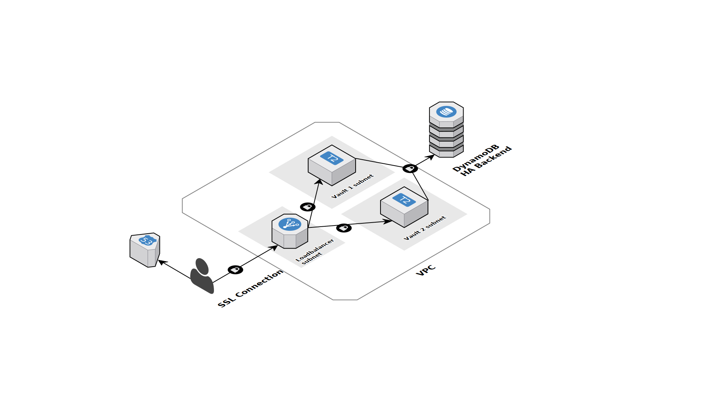

# Terraform Vault

Terraform module(s) to setup Vault on AWS

## Vault

This terraform module sets up a HA vault with a DynamoDB backend.
The module sets up TLS using Letsencrypt with dns-01 challenge.

Both vault servers are optionally configured with Teleport for SSH management.

Two route53 records are provided to access the individual instances.



### Available variables

| Name | Description | Type | Default | Required |
|------|-------------|:----:|:-----:|:-----:|
| acm_arn | The ACM ARN to use on the alb | string | - | yes |
| ami | The AMI ID to use for the vault instances | string | - | yes |
| dns_root | The root domain to configure for vault | string | `production.skyscrape.rs` | no |
| download_url_teleport | The download url for Teleport | string | `https://github.com/gravitational/teleport/releases/download/v2.3.5/teleport-v2.3.5-linux-amd64-bin.tar.gz` | no |
| download_url_vault | The download url for vault | string | `https://releases.hashicorp.com/vault/0.9.0/vault_0.9.0_linux_amd64.zip` | no |
| environment | Name of the environment where to deploy Vault (just for naming reasons) | string | - | yes |
| instance_type | The instance type to use for the vault servers | string | `t2.micro` | no |
| key_name | Name of the sshkey to deploy on the vault instances | string | - | yes |
| lb_internal | Should the ALB be created as an internal Loadbalancer | string | `false` | no |
| lb_subnets | The subnets to use for the alb | list | - | yes |
| project | Name of the project | string | - | yes |
| teleport_auth_server | The hostname or ip of the Teleport auth server. If empty, Teleport integration will be disabled (default). | string | `` | no |
| teleport_node_sg | The security-group ID of the teleport server | string | `` | no |
| teleport_token_1 | The Teleport token for the first instance. This can be a dynamic short-lived token | string | `` | no |
| teleport_token_2 | The Teleport token for the second instance. This can be a dynamic short-lived token | string | `` | no |
| vault1_subnet | The subnet ID for the first vault instance | string | - | yes |
| vault2_subnet | The subnet ID for the second vault instance | string | - | yes |
| vault_nproc | The amount of nproc to configure vault with. Set this to the amount of CPU cores | string | `1` | no |
| vpc_id | The VPC id to launch the instances in | string | - | yes |

### Output

| Name | Description |
|------|-------------|
| alb_arn | The alb ARN |
| alb_id | The alb id |
| alb_main_target_group | The default alb target group ARN |
| alb_sg_id | The alb security group ID |
| alb_vault1_target_group | The vault1 target group ARN |
| alb_vault2_target_group | The vault2 target group ARN |
| iam_policy | The iam policy ARN used for vault |
| sg_id | The vault security-group id |
| vault1_instance_id | The vault1 instance ID |
| vault1_role_id | The vault1 instance-role ID |
| vault1_role_name | The vault1 instance-role name |
| vault1_route53_record | The vault1 route53 record id |
| vault2_instance_id | The vault2 instance ID |
| vault2_role_id | The vault2 instance-role ID |
| vault2_role_name | The vault2 instance-role name |
| vault2_route53_record | The vault2 route53 record id |
| vault_route53_record | The main vault route53 record id |

### Example

```terraform
module "ha_vault" {
  source               = "github.com/skyscrapers/terraform-vault//vault?ref=1.0.0"
  teleport_auth_server = "10.10.0.100:3025"
  ami                  = "ami-add175d4"
  project              = "whatever"
  vault1_subnet        = "${data.terraform_remote_state.static.private_app_subnets[0]}"
  vault2_subnet        = "${data.terraform_remote_state.static.private_app_subnets[1]}"
  teleport_node_sg     = "${data.terraform_remote_state.static.teleport_node_sg_id}"
  vpc_id               = "${data.terraform_remote_state.static.vpc_id}"
  lb_subnets           = "${data.terraform_remote_state.static.public_lb_subnets}"
  acm_arn              = "${data.aws_acm_certificate.vault.arn}"
  teleport_token_1     = "c010f4fa754b7ad2a7a1d580e282d81b"
  teleport_token_2     = "6b69a780b9137g467f79ab7263337fd6"
  dns_root             = "${var.dns_root}"
  vault_nproc          = "2"
  key_name             = "sam"
}
```
